  <picture>
    <source media="(prefers-color-scheme: dark)" srcset="assets/dark.svg">
    <source media="(prefers-color-scheme: light)" srcset="assets/light.svg">
    
  </picture>

---

## 👨 About Me

Aspiring **Cybersecurity Professional** and **AI Automation Developer** with hands-on experience in Vulnerability Assessment & Penetration Testing (VAPT), web application security, OSINT, backend development using Python and FastAPI, and workflow automation using n8n and Make.com. Skilled in identifying security vulnerabilities, developing secure applications, automating business processes, and deploying applications on AWS. Ranked in the **Top 4% on TryHackMe** with 120+ completed security labs, and passionate about continuous learning in offensive security and AI-driven automation.

---

## Technical Skills

<table>
<tr>
<td valign="top" width="50%">

**Programming Languages**
- Python
- JavaScript
- HTML / CSS
- Bash

**Backend**
- FastAPI
- Node.js (Basic)
- REST APIs
- OAuth2
- JWT Authentication

**Frontend**
- React.js (Basic)
- HTML5 / CSS3
- JavaScript

**Databases**
- PostgreSQL
- MySQL

</td>
<td valign="top" width="50%">

**Cloud & DevOps**
- AWS EC2, IAM, RDS, S3 (Basic)
- AWS Amplify
- Nginx
- Git / GitHub / GitLab

**Automation**
- n8n
- Make.com
- AI Workflow Automation
- API Integration / Webhooks
- Automation Pipelines

**Meta Business Platform**
- Facebook & Instagram Graph API
- Meta Business Manager
- Facebook / Instagram Ads
- Messenger & Instagram Messaging API
- OAuth Authentication, Business Verification

</td>
</tr>
</table>

### Cybersecurity

Web Application Penetration Testing • VAPT • OWASP Top 10 • OSINT • Network Security • Linux Security • Windows Security • Privilege Escalation • Information Gathering • Enumeration • Vulnerability Assessment • Reconnaissance • Security Reporting

**Security Tools:** Burp Suite, Nmap, Wireshark, Metasploit, Gobuster, Nikto, Dirsearch, Hydra, SQLMap, FFUF, John the Ripper, Hashcat, OWASP ZAP

**Security Concepts:** XSS, SQL Injection, SSRF, CSRF, IDOR, XXE, File Upload Vulnerabilities, Authentication Bypass, Broken Access Control, Security Headers, CSP, JWT Security, API Security, Session Management, HTTPS/TLS, CVSS, CVE

**Networking:** TCP/IP, DNS, HTTP/HTTPS, DHCP, VPN, Firewall, Routing, Switching

**Linux:** Kali Linux, Ubuntu, Shell Scripting, Bash, Cron Jobs, SSH

---

## Projects

###  [CyberCortex](https://github.com/krishnaborude/CyberCortex)
Secure AI-powered Discord bot for ethical hacking education.
`Python` `FastAPI` `Discord API` `PostgreSQL`
- AI-assisted offensive security learning
- Interactive hacking commands
- Secure role-based authentication
- Custom cybersecurity utilities

###  [Workflow Automation Platform](https://boardview.me)
AI-powered workflow builder inspired by n8n.
`React` `FastAPI` `PostgreSQL`
- Drag-and-drop workflow builder
- AI Agents with stateful memory
- Custom automation nodes
- API integrations

###  [Authentication API](https://github.com/krishnaborude/login-signup)
FastAPI authentication system.
`FastAPI` `PostgreSQL` `OAuth2` `JWT`
- Password hashing, user registration, login API
- Role-based access control

###  [Mobile Detection (Computer Vision)](https://www.linkedin.com/in/krishnaborude/)
`YOLO`
- Real-time object detection & deep learning
- AI security monitoring
-  3rd Prize winner at Baap Company (Check on LinkedIn)

###  [Personal Portfolio](https://github.com/krishnaborude/My-protfolio-2)
Personal portfolio website built to showcase projects, skills, and experience as a developer.
`JavaScript` `HTML` `CSS`
- Clean, responsive web design
- Project gallery & contact forms

---

##  Achievements

-  Ranked in the **Top 4%** on TryHackMe
-  Completed **120+** hands-on cybersecurity labs on tryhackme
-  Won **3rd Prize** for the Mobile Detection project at Baap Company
-  Developed AI-powered workflow automation solutions using n8n and Make.com

---

## Certifications

- Practical Ethical Hacking
- Advent of Cyber 2025
- ReactJS for Beginners
- JavaScript (HackerRank)

**Currently pursuing:** eJPT • Security+ • Google Cybersecurity Professional Certificate • AWS Cloud Practitioner • PortSwigger Web Security Academy • Linux Essentials

---

## Soft Skills

Problem Solving • Analytical Thinking • Security Research • Technical Documentation • Team Collaboration • Communication • Continuous Learning • Time Management

---

## My Profiles

Here are the developer and learning platforms I actively use:

  
  
  
  
  
  

###  Social Media Profiles

Connect with me on social media:

  
  
  
  

---

### Let's Connect

Open to opportunities in **Cybersecurity / Penetration Testing**, **Full-Stack Development**, and **AI Automation**

